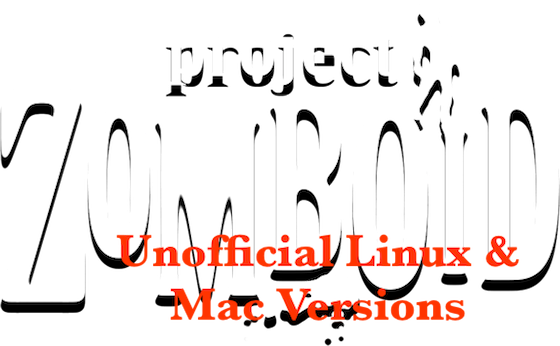

[Project Zomboid](http://projectzomboid.com/) is an awesome indie Zombie survival game. The atmosphere is great, the environment as well. The
romero-like zombies are well made. Only problem; it only works on Windows.

With the little adaptation that I did here, it works also great on OSX and Linux !

Get it
------

*Make sure to [Buy Project Zomboid](http://projectzomboid.com/blog/index.php/buy-our-games/) to get a login*

* [ProjectZomboid.app](https://github.com/downloads/zimbatm/project-zomboid-launcher/ProjectZomboid.app.0.1.5d.zip) - v0.1.5d for Mac
* [ProjectZomboid.tar.gz](https://github.com/downloads/zimbatm/project-zomboid-launcher/ProjectZomboid.0.1.5d.tar.gz) - v0.1.5d for Linux
* for Windows, got to the [Official Site](http://projectzomboid.com/)

Instructions
------------

Download, unpack, run the app. On linux, run `ProjectZomboid.sh`.

If you have issues, make sure your Java is up to date and read the
following section.

Known issues
------------

* [Ctrl doesn't work to swing the weapons. Use the Z key instead.](http://theindiestone.com/mantis/view.php?id=676)
* Bought the game from Desura and can't login ? Just enter the Desura game key. No login/password required.
* The Linux client only works in sandbox mode
* Mac 10.5 need to update their Java

Want to remove an existing key ?
--------------------------------

For Mac users, run `find /var/folders -name "*.log" -delete"`

For Linux users, ???

Changes
-------

* 2011-09-08: v0.1.5d released
* 2011-08-31: full packages for Linux and Mac
* 2011-08-30: first release of 0.1.5c

Problem ?
---------

* Issue: The game screen flickers on the login screen
* Solution: Just login

* Issue: The app doesn't open on OSX because it's "corrupted".
* Solution: Right-Click on the app, select the "Open" menu entry.

Have another problem ? [Create a ticket](https://github.com/zimbatm/project-zomboid-launcher/issues/new) with as much details as possible. Or send me an email at jonas@pfenniger.name

Coder ?
-------

Forks welcome. The code is available on GitHub :
[https://github.com/zimbatm/project-zomboid-launcher/](https://github.com/zimbatm/project-zomboid-launcher/)

Cheers, Jonas aka. [@zimbatm](http://twitter.com/zimbatm)
